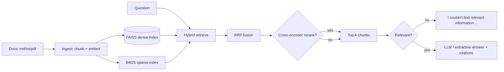

# Lending Copilot

A production-style **retrieval-augmented generation (RAG)** system that answers questions over
lending and credit-policy documents — with citations, hybrid retrieval, and an honest
"don't know" fallback instead of hallucinations.

Built as a portfolio project demonstrating end-to-end AI engineering: document ingestion,
chunking, dense + sparse hybrid retrieval with RRF fusion, cross-encoder reranking,
OpenAI-compatible LLM answering, evals, tests, and Docker packaging. **No LangChain /
LlamaIndex — the pipeline is hand-rolled** so the interesting parts are visible.

> **Sample data disclaimer:** everything under `data/sample_docs/` is **synthetic, fictional
> demo data** written for this project. Any resemblance to real institutions, products, or
> persons is coincidental. Drop your own PDFs / Markdown / text files into `data/uploads/`
> (or use `POST /ingest`) to query real documents.

## Architecture



**Retrieval recipe:** dense vectors (`all-MiniLM-L6-v2` + FAISS, cosine) and BM25 are fused
with **weighted reciprocal-rank fusion**, then optionally reranked with a cross-encoder
(`ms-marco-MiniLM-L-6-v2`). Every answer carries **citations** (source doc + chunk +
score). An **honesty gate** keeps the system from bluffing: it answers only when the
corpus shows substantive overlap with the question — measured by the top BM25 score
(idf weighting downranks pure stopword overlap), backstopped by the top dense cosine
for tiny corpora and paraphrases. Otherwise it says it doesn't know.

## Quickstart

```bash
make setup     # create venv + install deps
make ingest    # index the sample corpus
make serve     # API on :8000 + chat UI at http://localhost:8000
make eval      # run retrieval + answer evals
make test      # run pytest
```

Then ask a question:

```bash
curl -s -X POST localhost:8000/ask -H 'Content-Type: application/json' \
  -d '{"question":"What is the minimum CIBIL score for a personal loan?"}' | python -m json.tool
```

**Using an LLM for answers:** point `LENDING_LLM_BASE_URL` / `LENDING_LLM_MODEL` /
`LENDING_LLM_API_KEY` at any OpenAI-compatible API (OpenAI, Ollama, vLLM, LM Studio).
With no API key set, answers are **extractive** — the most relevant source excerpts with
citations — so the demo works fully offline.

| Provider | `LENDING_LLM_BASE_URL` | `LENDING_LLM_MODEL` |
|---|---|---|
| OpenAI | `https://api.openai.com/v1` | `gpt-4o-mini` |
| Ollama | `http://localhost:11434/v1` | `llama3.1` |
| vLLM | `http://localhost:8001/v1` | *(served model name)* |

## API reference

| Method | Path | Description |
|---|---|---|
| `GET` | `/health` | Status, indexed doc/chunk counts, LLM mode |
| `POST` | `/ingest` | Upload `.md`/`.txt`/`.pdf` files (multipart `files`) |
| `POST` | `/ask` | `{"question": str, "top_k"?: int, "rerank"?: bool}` → answer + citations + chunks |
| `GET` | `/` | Chat UI (served from `frontend/`) |

Example `/ask` response:

```json
{
  "answer": "A minimum CIBIL score of 650 is required… [Retail Credit Policy]",
  "citations": [{"doc_id": "retail_credit_policy", "title": "Retail Credit Policy",
                 "chunk_index": 2, "score": 0.0234}],
  "chunks": [{"citation": {"...": "..."}, "text": "…"}],
  "model": "extractive",
  "used_llm": false
}
```

## Evals

`evals/eval_set.jsonl` holds 15 question/answer pairs over the sample corpus.
`make eval` reports retriever **hit-rate@k** and **MRR**, plus answer **keyword coverage**
and **citation rate** as a groundedness proxy. Results are committed in `evals/results.md`.

<!-- EVAL_TABLE_START -->
| Metric | Value |
|---|---|
| Hit rate@5 | 1.000 |
| MRR | 0.756 |
| Avg keyword coverage | 0.978 |
| Citation rate | 1.000 |
<!-- EVAL_TABLE_END -->

*(Extractive mode, hash-embedder baseline run — see `evals/results.md` for the per-question
breakdown. Re-run with `make eval` after enabling the sentence-transformer backend or an
LLM to measure the full stack.)*

## Config reference

`config.yaml` holds all defaults; every key is overridable via `LENDING_<SECTION>_<FIELD>`
env vars (see `.env.example`).

| Key | Default | What it does |
|---|---|---|
| `retrieval.chunk_size` / `chunk_overlap` | 500 / 100 | Chunking window (chars) and overlap |
| `retrieval.top_k` | 5 | Chunks returned per question |
| `retrieval.dense_weight` / `sparse_weight` | 0.6 / 0.4 | RRF fusion weights |
| `retrieval.rrf_k` | 60 | RRF smoothing constant |
| `retrieval.rerank` | true | Cross-encoder rerank toggle |
| `retrieval.score_threshold` | 4.0 | Min top BM25 score; below this (and below `dense_threshold`) → "no relevant context" fallback. Tune to corpus size |
| `retrieval.dense_threshold` | 0.3 | Min top dense cosine; backstop for tiny corpora and paraphrased queries |
| `retrieval.embed_backend` | `sentence_transformers` | Or `hash` (fast/deterministic, used in tests) |
| `llm.base_url` / `model` / `api_key` | Ollama defaults / empty | Any OpenAI-compatible endpoint; empty key → extractive mode |

## Roadmap

- [ ] Streaming answers (SSE) in the chat UI
- [ ] Per-document access control for multi-tenant corpora
- [ ] Hybrid query rewriting / HyDE for vague questions
- [ ] Persistent eval tracking across runs (SQLite)
- [ ] Feedback loop: thumbs up/down stored per answer

## Project layout

```
lending-copilot/
├── src/                 # pipeline: config, chunking, embeddings, FAISS, BM25+RRF, LLM, API
├── data/sample_docs/    # 6 synthetic lending documents (demo data)
├── data/uploads/        # drop your own docs here
├── scripts/ingest.py    # CLI ingestion
├── evals/               # eval set, runner, committed results
├── tests/               # pytest suite
├── frontend/            # single-page chat UI (no build step)
├── config.yaml          # all knobs, env-overridable
└── Dockerfile Makefile  # packaging & workflows
```

## Author

**Tejasv Gupta** — Data Scientist @ Monsoon Fintech, Delhi, India.
[github.com/Tejasv609](https://github.com/Tejasv609)
